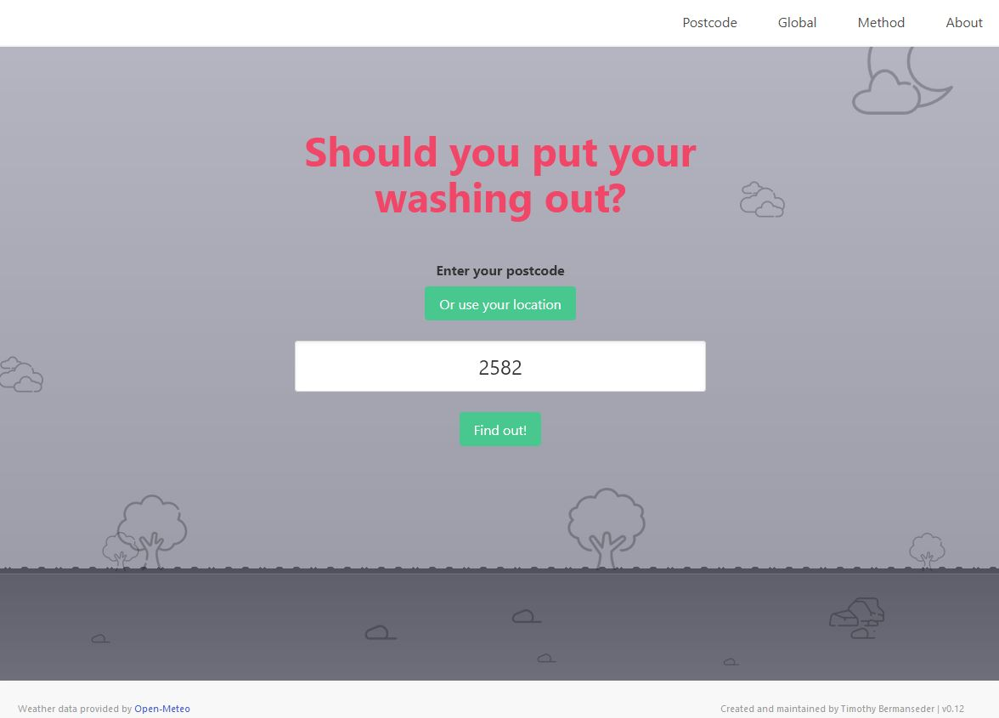

# Should I put my washing out? (WIP)

This cute little application will allow users to use their postcode (Or long and lat for global prediction) to determine how long it will take to for their washing to dry.

# NOTE: This project is still under construction and there will likely be bugs at the moment!

## Demo: [Should I put my washing out?](https://weather.tbwebapp.com)

## Tools/Technology used:

The key technology used:

- [Python](https://www.python.org/)
- [Flask](https://flask.palletsprojects.com/en/2.3.x/)
- [Gunicorn](https://gunicorn.org/)
- [Open Meteo](https://open-meteo.com/)

Python is utilised to handle interfacing with the Open Meteo API, calculating the clothes drying formula and searching through an SQLite database to compare Australian postcodes to their longitude and latitude.

Flask is used to construct the website backend.

Gunicorn is used on the server with Nginx to serve the website when users visit.

Open Meteo is the API used to pull global weather data based on a provided longitude and latitude.

## Methodology:

- Method for using postcode / Long lat + Open meteo
- Formula and method for drying determining dried washing here.

## References:

- Clothes drying research goes here
- Open Meteo doco
